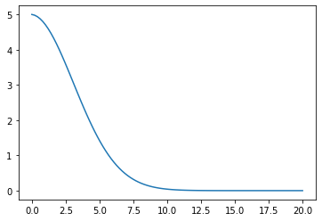
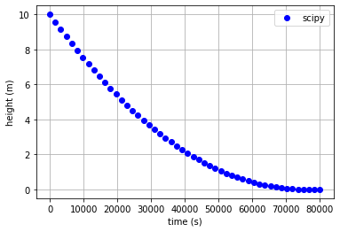
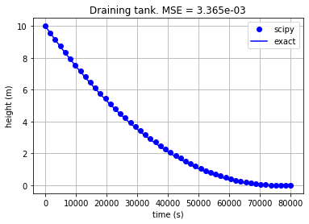

# Improving modularity of the lakes using Object Oriented Programming (OOP)

In the previous post I went through the steps of a "basic" implementation of the dynamics of the lakes using DAE approach. Using that working code, we can improve its modularity and reusability to implement series of lakes without repeting the basic code. With that we avoid incorporating small mistakes and also keep a clean, concise code that can be better reused and extended.

When it comes to a final design the components, there is no single, exact and perfect solution. There are multiple solutions that work, some may be better than others but all depends on the application and the required versatility and extensibility of the program.

To get a better idea of what I need, I will take into consideration a complete case provided by Petrone (2010), who developed a MPC for a hydro power valley consisting of 5 lakes and 4 section (reaches) of a river, with a tributary on the last section. The figure below illustrates this system:


Figure 1- Hydro Power Valley System (Petrone, 2010). Figure from Euan Russano - Own work

This shows some basic principles to be followed:
- Physical "objects" (lakes, valves, turbines, etc) should be represented by objects in the code.
- The design follows a kind of Composite Pattern (if you don't know what I'm talking about it, please see [here](https://en.wikipedia.org/wiki/Composite_pattern))
- Each "object" should have some kind of "port" so it is possible to connect one to another. For example, the outflow of Lake 1 is connected to the inflow of the valve, so that $q_{out}^{lake1} = q_{in}^{valve}$
- The composition of the model should be very extensive, such that I can have an object "lake 1", which together with a valve is contained in a component "P1", which in turn is contained in the one entity of the model.

Once I setup the model, I may use it to do some simulations or leave some degree of freedom in certain variables to proform optimizations. In this sense, I also make a separation between the model itself and the kind of problem.
In OOP:
+ The entire model is one object, which I can have several copies of it during the execution of a program.
+ The specific problem being solved (simulation or optimization) is a higher-level object, which may "contain" an instance of the model and it is run according a specific configuration.

Using the Composite Pattern, the structure of the model shown in Figure 1 could be represented as follows.


Figure 2- Composite structure of Hydro Power Valley System. Figure from Euan Russano - Own work

Figure 3 shows the internal structure of some basic blocks.


Figure 3- Internal representation of some blocks in the Hydro Power Valley System. Figure from Euan Russano - Own work

This Figure introduces some other objects that are part of the system: variable, constraint, parameter and port


# Implementation of the design using Python


```python
# imports
import numpy as np
import matplotlib.pyplot as plt
from scipy.optimize import minimize
```

Definition of the class Variable, which represents one variable in the optimization/simulation problem is as follows:


```python
class Variable:
    def __init__(self, index_var=[0], bounds=(None, None)):
        self.value = [100] * len(index_var)
        # create array of Nones with 2 None for each variable
        #bnds = np.array([None for i in range(len(index_var)* 2)])
        bnds = [bounds for i in range(len(index_var))]

        # reshape to have 2 Nones on last dimension
        #bnds = bnds.reshape(len(index_var), 2)
        self.bounds = bnds

    def get_bounds(self):
        return self.bounds

    def  __setitem__(self, key, item):
        '''
        This method is used to set a bound on a index of the variable
        e.g height[0] = 0.0
        '''
        # specify a single value or (min, max) for as a constraint for an
        # indexed var
        if isinstance(item, float) or isinstance(item, int):
            self.bounds[key] = (item, item)
        elif isinstance(item, tuple):
            self.bounds[key] = item
        else:
            raise ValueError('Only tuple or numeric values are allowed as bounds.')


    def set_value(self, x):
        self.value = x

    def __call__(self):
        return self.value
```

The definition of the constraint object, representing a hard constraint in the optimization/ simulation problem. Its definition follows the residual format, i.e $f(x,t)=0$


```python
class Constraint:
    def __init__(self, rule, lb=0, ub=0):
        self.rule = rule
        self.ub = lb
        self.lb = ub

    def __call__(self, model):
        return self.rule(model)
```

The Block represents the basic representation of a physical system.


```python
class Block:
    def __init__(self):
        self.variables = []
        self.constraints = []
        self.parent = None
        self.time = None

    def set_parent(self, parent):
        self.parent = parent

    def __setattr__(self, name, value):
        if isinstance(value, Variable):
            super().__setattr__(name, value)
            self.variables.append(value)
        elif isinstance(value, Constraint):
            self.add_cons( value, value.lb, value.ub)
        else:
            super().__setattr__(name, value)

    def update_time(self, time_vec):
        self.time = time_vec

    def change_inputs(self, x):
        self.parent.change_inputs(x)

    def add_cons(self, constraint, lb=0, ub=0):

        def cons(x):
            self.change_inputs(x)
            return constraint(self)

        self.constraints.append( {'type': 'eq', 'fun': cons} )
```

The Composite class represents the higher-level blocks, which contains one or several blocks or also other composite blocks.


```python
class Composite:
    def __init__(self):
        self.variables = []
        self.constraints = []
        self.blocks = []
        self.time = [0]
        self.parent=None

    def __setattr__(self, name, value):
        if isinstance(value, Block):
            block = value
            for variable in block.variables:
                self.variables.append(variable)
            for constraint in block.constraints:
                self.constraints.append(constraint)
            block.set_parent(self)
            block.update_time( self.time )
            self.blocks.append( block )
        super().__setattr__(name, value)

    def update_time(self, time_vec):
        self.time = time_vec
        for block in self.blocks:
            block.update_time( time_vec )

    def change_inputs(self, x):
        # if this is not a root block, then call recursively the parent until it reaches the root node
        if self.parent:
            self.parent.change_inputs(x)
        else: # this is the root node
            curr_index = 0
            for variable in self.variables:
                variable.set_value(x[curr_index:curr_index+len(variable.value)])
                curr_index += len(variable.value)

    def get_initial_guess(self):
        if self.parent:
            self.parent.get_initial_guess()
        else: # this is the root node
            xGuess = []
            for variable in self.variables:
                xGuess.extend(variable.value)

        return xGuess

    def get_bounds(self):
        # collect the bounds for all variables
        bnds = []
        for variable in self.variables:
            bnds.extend( variable.get_bounds() )

        return bnds

    def get_constraints(self):
        return self.constraints

    def connect(self, inport, outport):
        inport.set_variable(outport.get_variable())
```

Define classes for the ports, which connects different blocks


```python
class InPort:
    def __init__(self):
        self.variable = lambda: None

    def set_variable(self, variable):
        self.variable = variable

    def __call__(self):
        return self.variable()

class OutPort:
    def __init__(self, variable):
        self.variable = variable

    def get_variable(self):
        return self.variable

    def __call__(self):
        return self.variable()
```

Define a class `SimulationProblem`to handle simulations using the composed model.


```python
class SimulationProblem:

    def __init__(self, model):
        self.model = model

    def run(self, verbose = False):
        obj = lambda x: 0.0
        xGuess = self.model.get_initial_guess()
        bnds = self.model.get_bounds()
        cons = self.model.get_constraints()
        res = minimize(obj, xGuess, method='trust-constr',bounds=bnds, constraints=cons)
        if verbose:
            print(res)
        return res
```

# Testing the design with basic examples


### Non-linear system of equations

Example obtained from [APMonitor](https://apmonitor.com/wiki/index.php/Main/GekkoPythonOptimization).

Equation 1:
$$
x + 2y = 0
$$

Equation 2:
$$
x^2 + y^2 = 1
$$


```python
model = Composite()
sys1 = Block()
sys2 = Block()

sys1.x = Variable()      
sys2.y = Variable()

sys1.inport_y = InPort()
sys1.outport_x = OutPort(sys1.x)

sys2.inport_x = InPort()
sys2.outport_y = OutPort(sys2.y)


def eq1(block):
    x = block.x()
    y = block.inport_y()
    return x + 2*y - 0
sys1.eq1 = Constraint(eq1 )

def eq2(block):
    x = block.inport_x()
    y = block.y()
    return x**2+y**2-1
sys2.eq1 = Constraint(eq2)

model.sys1 = sys1
model.sys2 = sys2
model.connect(sys1.inport_y, sys2.outport_y)
model.connect(sys2.inport_x, sys1.outport_x)

sim = SimulationProblem(model)
result = sim.run()

model.change_inputs(result.x)
print('x  = ', model.sys1.x())
print('y  = ', model.sys2.y())

```

    x  =  [0.89442719]
    y  =  [-0.4472136]


    /home/euan/.local/lib/python3.8/site-packages/scipy/optimize/_hessian_update_strategy.py:182: UserWarning: delta_grad == 0.0. Check if the approximated function is linear. If the function is linear better results can be obtained by defining the Hessian as zero instead of using quasi-Newton approximations.
      warn('delta_grad == 0.0. Check if the approximated '


### Solving a simple differential equation

Example obtained from [APMonitor](https://apmonitor.com/wiki/index.php/Main/GekkoPythonOptimization).
$$
k\frac{dy}{dt}=-ty
$$

Initial condition:
$y(0)=5.0$


```python
model = Composite()
model.time = np.linspace(0,20,100)
sys1 = Block()

sys1.k = 10
sys1.y = Variable(model.time)

sys1.y[0] = 5.0

def eq1(block):
    dydt = (block.y()[1:] - block.y()[:-1])/np.diff(block.time)
    return block.k*dydt+block.time[1:]*block.y()[1:]
sys1.eq1 = Constraint(eq1 )


model.sys1 = sys1

sim = SimulationProblem(model)
result = sim.run()

model.change_inputs(result.x)
plt.plot(model.time, model.sys1.y())
```


    [<matplotlib.lines.Line2D at 0x7f762590af70>]





## Draining tank (same example from part 4 of this series)


```python
# some constants
RHO = 1000 # kg/m3 density of water
c = 0.62
g = 9.81
A = 16
A_orifice = 5e-4
m0 = 10*A*RHO

model = Composite()
model.time = np.linspace(0, 8e4, 50)

# tank model
tank1 = Block()
tank1.inport_inflow = InPort()
tank1.inport_outflow = InPort()
tank1.mass = Variable(model.time)
tank1.height = Variable(model.time)
tank1.outport_height = OutPort(tank1.height)
tank1.area = A

tank1.mass[0] = m0 # initial condition

def mass_balance(block):
    dmdt = np.diff(block.mass())/np.diff(block.time)
    inflow = block.inport_inflow()
    outflow = block.inport_outflow()
    if inflow is None:
        inflow = np.zeros_like(block.time)
    if outflow is None:
        outflow = np.zeros_like(block.time)
    resid = dmdt - (inflow[1:] - outflow[1:])
    return resid

tank1.mass_balance = Constraint(mass_balance)

def volume_height(block):
    resid = block.mass() - block.area*RHO*block.height()
    return resid

tank1.volume_height = Constraint(volume_height)

# orifice model
orifice = Block()
orifice.mass_flow_rate = Variable(model.time)
orifice.outport_flow = OutPort(orifice.mass_flow_rate)
orifice.inport_head = InPort()
orifice.area = A_orifice

def outflow(block):
    h = np.maximum(0.0, block.inport_head()) # height can not be negative due to sqrt
    resid = block.mass_flow_rate() - RHO*block.area*c*np.sqrt(2*g*h)

    return resid

orifice.mech_energy = Constraint(outflow)

model.tank1 = tank1
model.orifice = orifice
model.connect(tank1.inport_outflow, orifice.outport_flow)
model.connect(orifice.inport_head, tank1.outport_height)

sim = SimulationProblem(model)
result = sim.run()

model.change_inputs(result.x)
plt.plot(model.time, model.tank1.height(), 'bo', label='scipy');
plt.xlabel('time (s)')
plt.ylabel('height (m)')
plt.legend()
plt.grid();
```





Compare the simulated results with the analytical (exact) one to confirm that all is working as expected.


```python
def case1_exact(t):
    A_orifice = 5e-4
    A = 16.0
    h0 = 10.0
    t0 = 0.0
    c = 0.62
    g = 9.81

    h = (np.sqrt(h0) - A_orifice*c*np.sqrt(2*g)*(t-t0)/(2*A))**2

    return h

h_exact = case1_exact(model.time)

# Mean squared errors
MSE = np.mean((model.tank1.height() - h_exact)**2)

plt.plot(model.time, model.tank1.height(), 'bo', label='scipy');
plt.plot( model.time, case1_exact(model.time),'b', label='exact')
plt.xlabel('time (s)')
plt.ylabel('height (m)')
plt.legend()
plt.title(f'Draining tank. MSE = {MSE:.3e}')
plt.grid();
```





# Conclusion

In this post we have improved the interface of the model by creating classes and using them to hide the internal methods used to perform the simulation. In the next post I want to use inheritance to make the code even more modular and to make it easier to create multiple units with similar physical behavior without repeating the same code. I see you in the next post.
