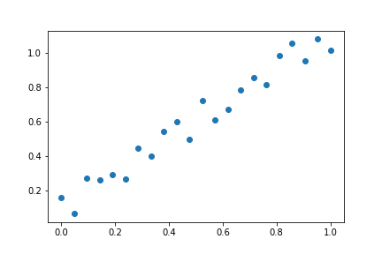
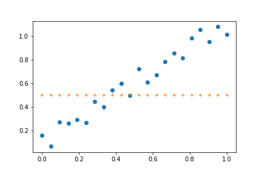
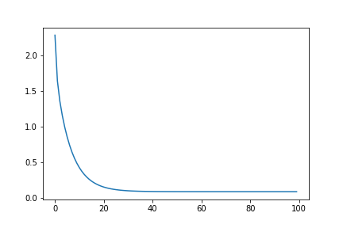

Among the variety of models available in Machine Learning, most people will agree that **Linear Regression** is the most basic and simple one. However, this model incorporates almost all of the basic concepts that are required to understand **Machine Learning** modelling.

In this example, I will show how it is relatively simple to implement an univariate (one input, one output) linear regression model.
<!-- more -->

Coming back to the theory, linear regression consists in a statistical hypothesis, stating that the relation between two (or more) variables is linear, i.e they increment by the same quantity, directly or inversely proportional. Finding an accurate linear regression validates such hypothesis applied to a certain dataset.

The basic equation structure is:

$$
y = \theta_0 + \theta_1 x
$$

Where $y$ is the output (dependent variable), $x$ is the input, and $\theta_0$ as well as $\theta_1$ are the model parameters. The determination of a linear regression model consists in finding the optimum set of parameters that enables use to use the model to predict values of $y$ by using as input the values of $x$.

To better understand, consider that one wants to predict the housing prices  in a certain neighborhood by using as input the house size. This makes sense, since one can logically imagine that bigger houses (higher area) will have higher prices. However, the hypothesis stated by the linear regression is that such relation between variables is linear.

To evaluate that, let's work with a "manually" created dataset, which will be easier since we will know from the beginning that the hypothesis is valid for it. And just to give a sense of real-world, we will add some noise to the expected output $y$.

For visualization, we will use the library matplotlib.pyplot, and we will use the library random() to generate the white noise on the variable $y$. So we should import both of them right in the beginning.

```python
import matplotlib.pyplot as plt
import random
```

Now let's create the variable $x$ and the variable $y$. I chose $y$ to be modelled according the following equation:

$$y = -1 + 2x + e$$

where $e$ consists in the error (white-noise). Ignoring this term, the linear regression parameters should be equal to $\theta_0 = -1$ and $\theta_1 = 2$ after the calibration process. The following code is used to generate the data.

```python
x = list(range(-10,12))
y = [2*xval-1 for xval in x]
```

The first step of pre-processing the data consists in performing normalization. This will transform the ranges from the original one to values between 0 and 1. The following formula is used for that.

$$
x' = \frac{x - min(x)}{max(x) - min(x)}
$$

The following code is used to perform normalization and also add the white-noide to the output variable $y$, so as to give it an apperance of real-world variable.

```python
random.seed(999)
# normalize the values
minx = min(x)
maxx = max(x)
miny = min(y)
maxy = max(y)
x = [(xval - minx)/(maxx-minx) for xval in x]
y = [(yval - miny)/(maxy-miny) + random.random()/5 for yval in y] 
print(x)
print(y)

plt.plot(x,y,'o')
```



Assume an initial guess for the parameters of the linear regression model. From this value, we will iterate until the optimum values are found. Let's assume that initially $\theta_0 = 0.5$ and $\theta_1 = 0$, which basically creates a flat (horizontal) line at y = 0.5.



It is possible to adjust the parameters of the linear regression model analytically, i.e with no iteration but using an equation. This analytical method is known as the Least Squares Method or the Normal Equation method. However, since this technique os almost only applicable to linear regression, I chooe to use the iterative approach, because it is more general and will give a better sense of how machine learning models are usually trained.

The algorithm that we will use the Gradient Descent. A good explanation of it can be found in <a href="https://en.wikipedia.org/wiki/Gradient_descent">Wikipedia</a> for instance, so I won't bother myseelf to be writing here the basic concepts. Maybe I will leave that to another post.

Applying the Gradient Descent method means to be updating iteratively the parameters of the linear regression model according the following formula.

At each iteration until convergence:  
$$
\theta_j^{n+1} = \theta_j^{n} - \alpha \times \frac{\partial J}{\partial \theta_j}
$$

Where $j$ is the parameter index (in this case, 0 or 1), $\alpha$ is a constant called learning rate and adjusts the velocity of the update. The function $J$ is the one to be minimizes. In modelling, we usually want to minimize the errors of the model when compared with the observed value. So let's say $J$ is the sum of the squared errors (to make everything positive).

$$
J = \sum (y_{pred} - y)^2
$$

Where $y_{pred}$ is the predicted output (from the model) and $y$ is the observed value (dataset). The derivatives with respect to each parameter can be written as:

$$
\frac{\partial J}{\partial \theta_j} = \sum (y_{pred} - y)\times x_j
$$

Where $x_j$ is the input multiplying $\theta_j$, so for $theta_0$, $x_0 = 1$, but for $\theta_1$ then it multiplies with the input variable $x$.

We will do 100 iterations using a learning rate of 0.05. Also, we will collect the parameter and cost function $J$ evolution in lists called `theta_history` and `J`.

```python
epochs = 100 # number of iterations
learning_rate = 0.05

theta_history = [[theta0,theta1]]
J = list()
```

Then, for each iteration, we calculate the const function $J$, the gradients with respect to each parameters, the update equation and the new prediction value.

```python
for epoch in range(epochs):
    J.append((sum([(ypredval-yval)**2 for ypredval,yval in zip(ypred,y)])))
    print('J = ',J[-1])
    
    dJd0 = (sum([ypredval - yval for ypredval,yval in zip(ypred,y)]))
    dJd1 = (sum([(ypredval - yval)*xval for ypredval,yval,xval in zip(ypred,y,x)]))
    
    theta0 = theta0 - learning_rate*dJd0
    theta1 = theta1 - learning_rate*dJd1
    
    theta_history.append([theta0,theta1])
    
    ypred = [theta0 + theta1*xval for xval in x]
	
plt.plot(J)
```



Notice how the cost function $J$ shown above drastically reduces initially, reaching a relatively stable plateau. That is normally expected when training a model. The plateau occurs because of convergence to the minimum is near to be satisfied, so the iteration process may be interrupted at a determined point of this process without losing too much accuracy.

Notice now the model accuracy as plotted below.

```python
plt.plot(x,y,'o')
plt.plot(x,ypred,'+')
```

 and Observed (o) values.")

With this example, you have seen how it is possible and not so complicate to build a univariate linear regression with Python. Notice that we only used libraries for plotting and to create pseudo random numbers. Not even Numpy or Scipy was used.

The Jupyter notebook for this tutorial can be downloaded from [here](./code/linearRegressionScratch.ipynb)! If you want it as python code, download it [here](./code/linearRegressionScratch.py)!

If you want it as python code, download it [here](./code/linearRegressionScratch.py)!

Thanks for reading this post and see you soon!

