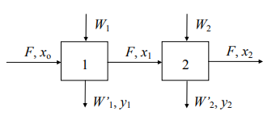
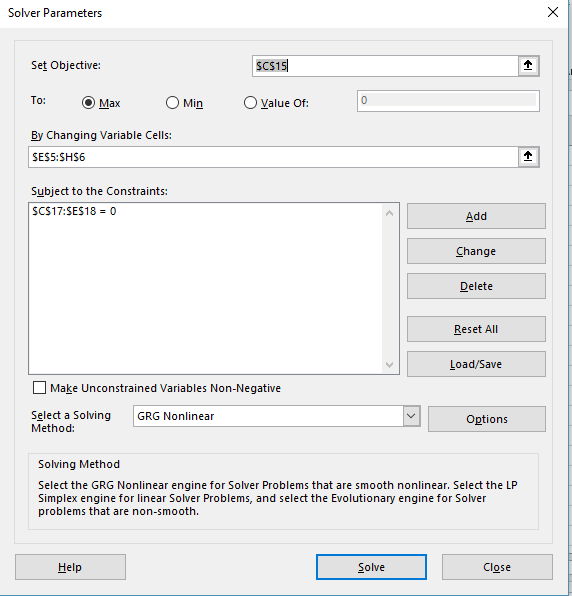

A common problem which many engineers face on their jobs is process optimization. How to maximize a profit or how to minimize costs of a determined process so as to make it the most profitable possible? There is a diversity of mathematical techniques which can be used to solve such problem. Most of these techniques differ in its applicability when a problem is linear or non-linear.

<!-- more -->

A optimization problem can be solved using computational tools. Currently, there is a huge amount of such tools, and the choice of it depends on the complexity of the problem, the experience and familiarity of the engineer with the tool as well as time and money available.

MS Excel is one of the most popular, widespread softwares for data analysis available in the market. It possesses a great visualization power because of its spreadsheets functionality. Its functions and tools does not require the too much expertise from the user, nor programming knowledge, unless the user wants to learn advanced functionalities (VBA programming).

For optimization purposes, it is not necessary that the user possesses advanced domain of the software. The problem is completely described in the spreadsheet(s) and after setting it up, an add-in called Solver may be used to maximize or minimize certain characteristics of the process.

For the purpose of this post, consider the following example extracted from COQ-897 Otimização de Processos (PEQ/COPPE/UFRJ).

**Example 1.2:** In the process of extraction using pure solvent, as illustrated below, one desires to find the operating condition with the best profit possible.

Where *Wi* and *W'i* are solvent mass flow rates, *F* is water mass flow rate, *xi* is the solute mass per mass unit of water and yi is the solute mass per mass unit of solvent. An economic analysis of the problem conducts to the following profit expression:

profit: L = R – C

revenue: R = Ps (W’1 y1 + W’2 y2)

cost: C = Px (W1 + W2)

constraint: R &gt; C

Where Os is the solute price while in the extract, Px is the price of pure solvent. A technical analysis revealed the following constraint relations:

Solute Mass Balance:

$$
F x_0 – W'_1 y_1 – F x_1 = 0
$$

$$
F x_1 – W’_2 y_2 – F x_2 = 0
$$

Solvent Mass Balance:

$$
W_1 – W’_1 – s F = 0
$$

$$
W_2 + s F – W’_2 – s F = 0
$$

Equilibrium relations:

$$
y_1 = m x_1
$$

$$
y_2 = m x_2
$$

Where $$s$$ is the solubility of the solvent in water(solvent mass / mass of water) and m is the equilibrium constant between phases. Therefore, given $$F$$, $$x_0$$, $$s$$, $$m$$, $$Ps$$ and $$Px$$, the problem of extracting the solute from water in the most profitable manner consists in maximizing L as a function of the operating conditions.

Suppose:  
$$F = 1.0 \times 10^4$$ kg-water / h,  
$$x_0 = 0.02 $$ kg-solute / kg-water,  
$$s = 7.0 \times 10^{-4}$$ kg-solvent / kg-water,  
$$m = 4.0 $$ kg-water / kg solvent,  
$$Ps = 0.4 $$ USD / kg-solute and  
$$Px = 0.01 $$ USD / kg-solvent.

We want to solve such problem using the software MS Excel. The first step consists in annotating all the inputs of the system in the following manner (use a spreadsheet in Excel - first line and column should be the same in your spreadsheet):

|   | A | B |
| :--- | :--- |:--- |
| 4 | Ps | 0.4000  |
| 5 | Px | 0.0100  |
| 6 | s	 | 0.0007  |
| 7 | m	 | 4.0000  |
| 8 | F	 | 10000.0 |
| 9 | x0 | 0.0200  |
| 10 | y0 | 0.0800  |

The operating conditions can also be inserted in Excel at their own column, which will be afterwards recalculated by Excel using Solver:

|  | D | E | F  | G | H |
| :--- | :--- | :--- |:--- | :--- |:--- |
| 4 |Unit |	W	 |  W'	| x	   | y    |
| 5 |1	  | 1000 | 1000	| 0.01 | 0.01 |
| 6 |2	  | 1000 | 1000	| 0.01 | 0.01 |

Observe that these are initial conditions of the problem, thus the chosen value may not be physically feasible, i.e do not fulfill mass balance constraints. That will not be a problem because the constraints will be considered during the optimization procedure, so we will arrive in a physically feasible optimum.

Now use the equations for income, costs, profits and constraints to have cells where these values are calculated. In my spreadsheet, I used the following Excel formulas:

Income (cell C13): `=$B$4*(F5*H5+F6*H6)`

Costs (cell C14): `=B5*SUM(E5:E6)`

Profit (cell C15): `=C13-C14`

Constraints:  
Solute Unit 1 (cell C17):`=$B$8*$B$9-F5*H5-$B$8*G5`  
Solvent Unit 1 (cell D17):`=E5-F5-$B$6*$B$8`  
Equilibrium Unit 1 (cell E17):`=H5-$B$7*G5`

Solute Unit 2 (cell C18): `=$B$8*$G$5-F6*H6-$B$8*G6`  
Solvent Unit 2 (cell D18): `=E6-F6-$B$6*$B$8`  
Equilibrium Unit 2 (cell E18): `=H6-$B$7*G6`

And these cells are defined in Excel using the following format:

|  | A | B | C  | D | E |
| :--- | :--- | :--- |:--- | :--- |:--- |
| 16 |Constraints |	Unit | Solute |  Solvent | Equilibrium |
| 17 | Unit 1	 |   1   | 90	  |   -7   | -0.03 |
| 18 | Unit 2	 |   2   | -10	  |   -7   | -0.03 |

The values in the cell are not inserted, but automatically calculated by excel using the formulas previously stated. With this the spreadsheet is completely configured.

After configuring everything, it is time to proceed to optimization. To do that, start Solver (it is located in the tab Data in Excel. If you do not find it, it is necessary to configure it in Excel Options. Write a comment if you need any help with that). The solver screen is as shown below.
 

Make sure you add the current optimization cell, chose the "Max" radio button and add the constraints with the Add button and your Solver window should look the same as the figure above. Then simply click Solve and see how the operating conditions change, in such a way that the constraints are almost zero (or zero exactly) and the Profit variable is maximized. You may slightly change the operating conditions to check if the profit is really the maximum possible.

The results for the optimization should be:

Income (cell C13):43.16

Costs (cell C14):23.82

Profit (cell C15):19.34

And the final operating conditions:

|  | D | E | F  | G | H |
| :--- | :--- | :--- |:--- | :--- |:--- |
| 4 |Unit |	W	 |  W'	| x	   | y    |
| 5 |1	  | 1199.99 | 1183.99 | 0.0135 | 0.0542 |
| 6 |2	  | 1191.04 | 1184.04 | 0.00921 | 0.0368 |

<a href="./code/example_optimization.xlsx" download>
  📥 Download the Spreadsheet configured here
</a>

In the next post, I will show you guys how to use other tool to solve the same problem. Do not miss it!
